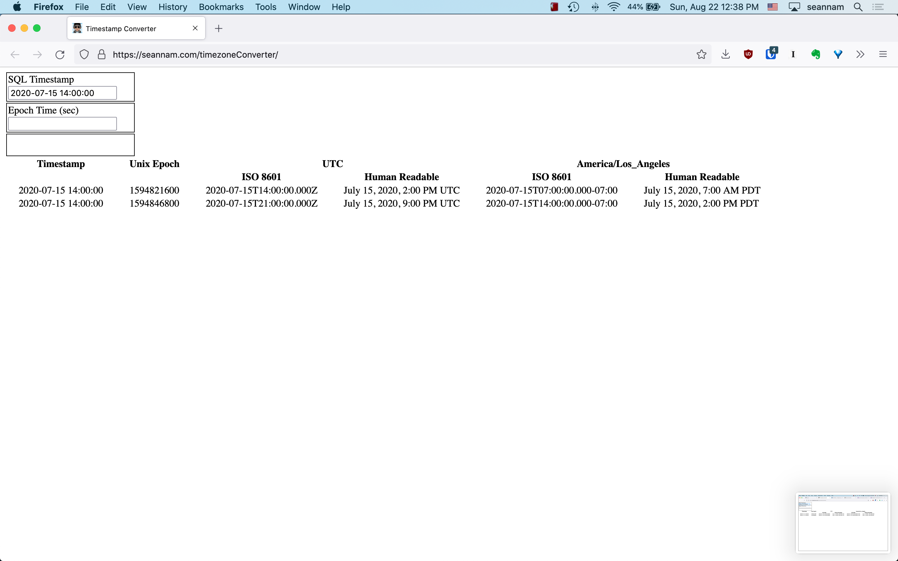

# Timezone Converter

This is a simple timezone converter. The input is a SQL formatted timestamp. The outputs are two rows. Each row produces a ISO 8601 formatted string and a human readable string for both UTC and Pacific time. The first row assumes the input is in UTC time and the second input assumes the input is in Pacific time.

